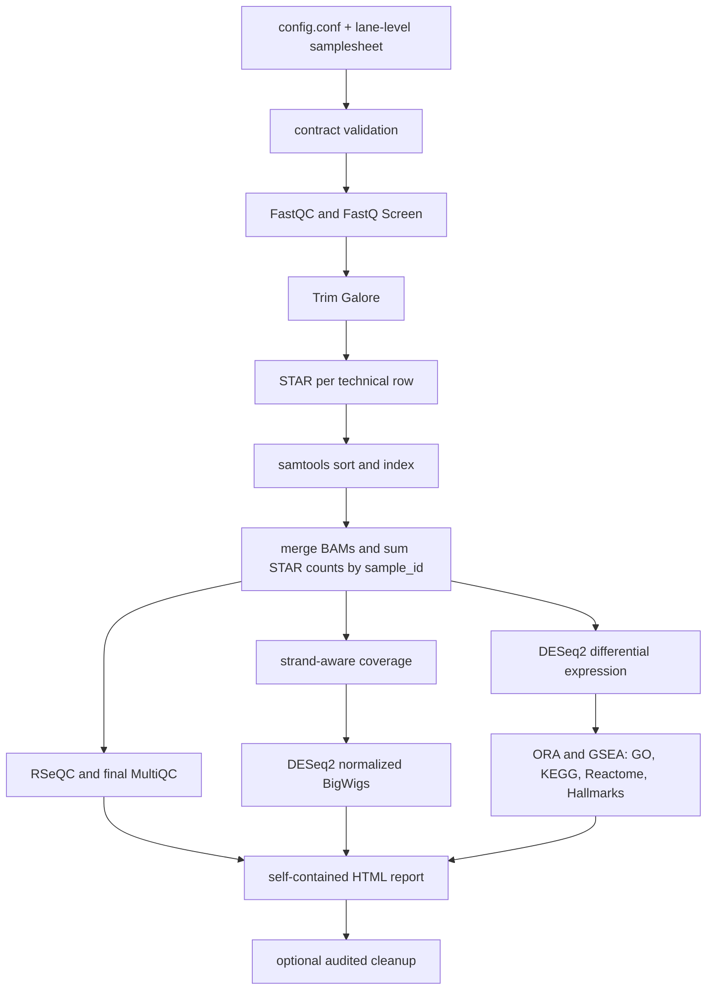

# rnaseq2tracks

`rnaseq2tracks` is an end-to-end, server-oriented workflow for conventional
single-end or paired-end RNA-seq. It turns raw FASTQ files into audited QC,
sample-level BAMs, strand-aware normalized BigWigs, DESeq2 differential-expression
results, functional enrichment and a self-contained HTML report.

The current architecture adopts the operational contracts proven in
`rna_ends2tracks`: lane-level metadata, explicit biological samples, deterministic
technical-replicate merging, a stable installed launcher, one master log,
checkpointed resume and run provenance.

## Quick start

No environment activation or manual `PATH` export is required after the shared
release has been installed.

```bash
mkdir -p /home/user/Analysis/my_project/config
cp /opt/conda_envs/rnaseq2tracks-*/share/rnaseq2tracks/config/config_template.conf \
  /home/user/Analysis/my_project/config/config.conf
cp /opt/conda_envs/rnaseq2tracks-*/share/rnaseq2tracks/config/samplesheet_template_PE.csv \
  /home/user/Analysis/my_project/config/samplesheet.csv

rnaseq2tracks --config /home/user/Analysis/my_project/config/config.conf
```

For a detached server run:

```bash
PROJECT=/home/user/Analysis/my_project
nohup rnaseq2tracks --config "$PROJECT/config/config.conf" \
  > "$PROJECT/rnaseq2tracks.launch.log" 2>&1 &
echo $! > "$PROJECT/rnaseq2tracks.pid"
```

The workflow itself writes the complete chronological log to
`OUTDIR/logs/rnaseq2tracks.log` and its current state to
`OUTDIR/metadata/run_status.tsv`.

## Samples: biological units, technical libraries and lanes

Each CSV row is one FASTQ-producing technical unit. Rows with the same
`sample_id` belong to one biological sample and are merged before DESeq2 and
sample-level track generation.

```csv
sample_id,biological_replicate_id,technical_replicate_id,lane_id,fastq_R1,fastq_R2,condition,strandedness,batch,description
WT_R1,R1,T01,L001,/data/WT_R1_L001_R1.fastq.gz,/data/WT_R1_L001_R2.fastq.gz,WT,reverse,batch1,WT replicate 1
WT_R1,R1,T01,L002,/data/WT_R1_L002_R1.fastq.gz,/data/WT_R1_L002_R2.fastq.gz,WT,reverse,batch1,WT replicate 1
WT_R2,R2,T01,L001,/data/WT_R2_L001_R1.fastq.gz,/data/WT_R2_L001_R2.fastq.gz,WT,reverse,batch1,WT replicate 2
```

Here the first two rows are lanes of one biological sample, not two replicates.
They are aligned independently, then their BAMs and STAR counts are consolidated
into `WT_R1`. DESeq2 receives `WT_R1` and `WT_R2` as two biological samples.

## Workflow



## Main capabilities

- Single-end and paired-end libraries.
- Unstranded, forward-stranded and reverse-stranded protocols.
- Human and mouse reference configurations.
- Multiple lanes and technical libraries per biological sample.
- FastQC, FastQ Screen, MultiQC, STAR QC and RSeQC, including gene-body coverage.
- Biological-sample BAMs and raw/DESeq2-normalized, strand-aware BigWigs.
- DESeq2 models and contrast-level tables, MA plots and volcano plots.
- ORA and ranked GSEA against GO BP/MF/CC, KEGG, Reactome and Hallmarks.
- Condition-level merged tracks (configurable).
- UCSC descriptor generation when a real `UCSC_BASE_URL` is supplied.
- Checkpointed restart, chronological logging, status and checksummed provenance.
- Optional post-success cleanup of regenerable large intermediates.

## Configuration model

All project settings, including `SAMPLESHEET`, are stored in one `config.conf`.
Relative paths are resolved from the config file's directory. The only launch
argument is:

```bash
rnaseq2tracks --config /absolute/path/to/config.conf
```

Every unique pair of samplesheet conditions is compared automatically. No
`contrasts.csv` is required. Advanced users may set `CONTRASTS` to an explicit
CSV when they intentionally want only a subset or a custom comparison order.

Important resource settings are `MAX_JOBS`, `STAR_THREADS`,
`SAMTOOLS_THREADS`, `FASTQC_THREADS` and `FASTQSCREEN_THREADS`. Approximate
maximum STAR CPU demand is `MAX_JOBS × STAR_THREADS`; configure it within the
server's CPU and memory budget.

## Outputs to inspect first

| Output | Purpose |
|---|---|
| `reports/pipeline_report.html` | integrated final report |
| `multiQC/final/multiQC_final.html` | detailed sequencing and alignment QC |
| `07_qc/rseqc/genebody/` | RNA integrity and gene-body bias |
| `07_qc/star/star_alignment_summary.tsv` | lane-level STAR mapping summary |
| `metadata/technical_merge_audit.tsv` | lanes merged into each biological sample |
| `analysis/DE/` | DE tables, MA and volcano plots |
| `analysis/enrichment/` | ORA/GSEA tables and figures |
| `bigwig/` | sample and condition browser tracks |
| `logs/rnaseq2tracks.log` | complete chronological log |
| `metadata/run_provenance.tsv` | final version, inputs and hashes |

## Documentation

- [Documentation index](docs/README.md)
- [Quick start](docs/QUICK_START.md)
- [Samplesheet and technical replicates](docs/SAMPLESHEET.md)
- [Configuration](docs/CONFIGURATION.md)
- [Workflow and methods](docs/WORKFLOW.md)
- [QC interpretation](docs/QC.md)
- [Differential expression and enrichment](docs/ANALYSIS.md)
- [Outputs](docs/OUTPUTS.md)
- [Logging, resume and cleanup](docs/OPERATIONS.md)
- [Server installation](docs/INSTALLATION.md)
- [Migration and repository rename](docs/MIGRATION.md)
- [Limitations](docs/LIMITATIONS.md)
- [Architecture comparison and backport rationale](docs/ARCHITECTURE_COMPARISON.md)

## Release installation

An administrator installs a tagged release once. The installer builds a pinned,
read-only environment and promotes a stable launcher:

```bash
bash scripts/bash/install_release.sh --tag v6.0.0-alpha.1.post1
```

This produces a self-contained launcher such as
`/opt/conda_envs/bin/rnaseq2tracks-6.0.0-alpha.1.post1` and the stable
`/opt/conda_envs/bin/rnaseq2tracks`. Users do not activate Conda.

## Naming migration

This project was formerly published as `rnaseq2tracksP`. Code, launch examples,
environment names, citation metadata and documentation now use `rnaseq2tracks`.
The GitHub repository itself must be renamed in GitHub **Settings → General →
Repository name**. Existing GitHub URLs normally redirect, but local clones should
update `origin`; see [MIGRATION.md](docs/MIGRATION.md).

## Citation and license

Citation metadata are in [CITATION.cff](CITATION.cff). The workflow is released
under the [MIT License](LICENSE).
