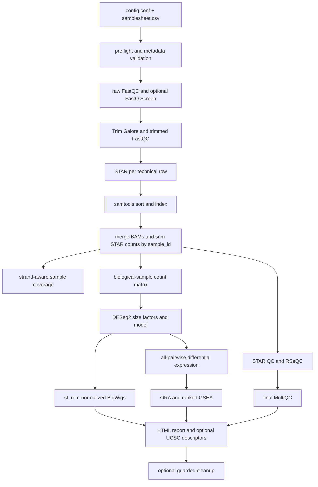

# rnaseq2tracks

`rnaseq2tracks` is an end-to-end, server-oriented workflow for conventional
single-end (SE) and paired-end (PE) bulk RNA-seq. It converts lane-level FASTQ
inputs into audited quality control, biological-sample BAMs, strand-aware
normalized BigWigs, DESeq2 differential-expression results, functional
enrichment, and a self-contained HTML report.

The workflow shares the operational design used by `rna_ends2tracks`: explicit
biological and technical units, deterministic lane consolidation, a stable
installed launcher, one chronological master log, resumable checkpoints, and
checksummed run provenance. The biological methods remain appropriate for
conventional whole-transcript RNA-seq; PAS calling and APA analysis are not part
of this workflow.

## Supported scope

- Human and mouse conventional bulk RNA-seq.
- Project-wide SE or PE layout.
- Unstranded, forward-stranded, or reverse-stranded libraries.
- Multiple lanes and technical libraries per biological sample.
- Automatic all-pairwise condition comparisons, with an optional expert-defined
  contrast subset.
- FastQC, FastQ Screen, MultiQC, STAR metrics, and RSeQC.
- DESeq2 expression analysis, sample-relationship plots, ORA, and ranked GSEA.
- GO BP/MF/CC, KEGG, Reactome, and MSigDB Hallmark enrichment.
- Sample-level and optional condition-level UCSC-compatible BigWigs.

Single-cell, spatial, long-read, small-RNA, transcript-isoform, and dedicated
3'-end/APA analyses are outside the supported scope. See
[limitations](docs/LIMITATIONS.md).

## Quick start

After a shared release is installed, users do not activate Conda or export tool
paths.

```bash
PROJECT="$HOME/Analysis/my_rnaseq_project"
RELEASE_ENV="/opt/conda_envs/rnaseq2tracks-6.0.0a1.post1"

mkdir -p "$PROJECT/config"
cp "$RELEASE_ENV/share/rnaseq2tracks/config/config_template.conf" \
  "$PROJECT/config/config.conf"
cp "$RELEASE_ENV/share/rnaseq2tracks/config/samplesheet_template_PE.csv" \
  "$PROJECT/config/samplesheet.csv"

rnaseq2tracks --config "$PROJECT/config/config.conf"
```

Choose `samplesheet_template_SE.csv` for a single-end project. Replace the
example release path with the environment corresponding to the installed
`rnaseq2tracks --version` when using another release.

For a detached server run:

```bash
RUN_LOG="$PROJECT/rnaseq2tracks.launch.log"
PID_FILE="$PROJECT/rnaseq2tracks.pid"

nohup rnaseq2tracks --config "$PROJECT/config/config.conf" \
  > "$RUN_LOG" 2>&1 &

RUN_PID=$!
echo "$RUN_PID" > "$PID_FILE"
disown "$RUN_PID"
```

The external `nohup` log captures launcher output. The authoritative
chronological workflow log is `OUTDIR/logs/rnaseq2tracks.log`.

## Input model

`config.conf` and `samplesheet.csv` are the only required project-configuration
files. The samplesheet path is stored in `config.conf`; it is not a positional
launch argument. No separate contrast file is needed by default.

Each samplesheet row is one FASTQ-producing technical unit. Rows with the same
`sample_id` represent one biological sample and are merged before downstream
counting, visualization, and statistics.

```csv
sample_id,biological_replicate_id,technical_replicate_id,lane_id,fastq_R1,fastq_R2,condition,strandedness,batch,description
WT_R1,R1,T01,L001,/data/WT_R1_L001_R1.fastq.gz,/data/WT_R1_L001_R2.fastq.gz,WT,reverse,batch1,WT replicate 1
WT_R1,R1,T01,L002,/data/WT_R1_L002_R1.fastq.gz,/data/WT_R1_L002_R2.fastq.gz,WT,reverse,batch1,WT replicate 1
WT_R2,R2,T01,L001,/data/WT_R2_L001_R1.fastq.gz,/data/WT_R2_L001_R2.fastq.gz,WT,reverse,batch1,WT replicate 2
```

The first two rows are lanes of `WT_R1`; they are not two biological
replicates. STAR runs independently for each row, after which BAMs and STAR gene
counts are consolidated into one `WT_R1` sample. DESeq2 receives `WT_R1` and
`WT_R2` as independent biological units.

## Data flow



RSeQC runs in the background after biological-sample BAM consolidation while
coverage, normalization, tracks, and DE analysis proceed. The workflow waits for
RSeQC before building the final MultiQC report.

## Outputs to inspect first

| Output | What it answers |
|---|---|
| `reports/pipeline_report.html` | Did requested modules finish, and what are the principal QC/DE/enrichment results? |
| `multiQC/final/multiQC_final.html` | Are read quality, contamination, trimming, and alignment metrics acceptable? |
| `07_qc/star/star_alignment_summary.tsv` | How many reads mapped uniquely or to multiple loci in each lane? |
| `07_qc/rseqc/` | Is orientation correct, and is coverage distributed plausibly across genes and gene bodies? |
| `metadata/technical_merge_audit.tsv` | Which technical rows were consolidated into each biological sample? |
| `analysis/figures/` | Do PCA, clustering, and variable-gene patterns support the sample design? |
| `analysis/DE/` | Which genes change in each pairwise contrast? |
| `analysis/enrichment/` | Which functional programs are over-represented or coordinately shifted? |
| `bigwig/` | What is the strand-aware sample or condition coverage in a genome browser? |
| `logs/rnaseq2tracks.log` | What happened, in chronological order? |
| `metadata/run_provenance.tsv` | Which release and hashed inputs produced this run? |

## Monitoring and restart

```bash
tail -F /path/to/OUTDIR/logs/rnaseq2tracks.log
column -t -s $'\t' /path/to/OUTDIR/metadata/run_status.tsv
```

If the process stops, correct the reported cause and rerun the identical launch
command. Completed lane-, sample-, and stage-level outputs are reused. There is
currently no `status` subcommand and no validate-only/dry-run CLI; do not copy
those commands from `rna_ends2tracks` documentation.

## Documentation

Start with the [documentation index](docs/README.md):

- [Quick start](docs/QUICK_START.md)
- [Workflow steps and dependencies](docs/WORKFLOW.md)
- [Configuration guide](docs/CONFIGURATION.md)
- [Samplesheet and replicate hierarchy](docs/SAMPLESHEET.md)
- [Methods and normalization](docs/METHODS.md)
- [Quality-control overview](docs/QC.md)
- [FastQ Screen](docs/FASTQ_SCREEN.md)
- [RSeQC](docs/RSEQC.md)
- [Differential expression and enrichment](docs/ANALYSIS.md)
- [Final report and outputs](docs/OUTPUTS.md)
- [Operations and troubleshooting](docs/OPERATIONS.md)
- [Shared-server installation](docs/INSTALLATION.md)
- [Migration from `rnaseq2tracksP`](docs/MIGRATION.md)
- [Limitations](docs/LIMITATIONS.md)

## Installation

Administrators install a tagged release into a versioned, immutable environment
and atomically promote the stable launcher:

```bash
bash scripts/bash/install_release.sh --tag v6.0.0-alpha.1.post1
```

The validated shared-server release is `v6.0.0-alpha.1.post1`. Users invoke the
stable `rnaseq2tracks` command without environment activation. See
[INSTALLATION.md](docs/INSTALLATION.md) for clean-shell validation and rollback.

## Citation and license

Citation metadata are in [CITATION.cff](CITATION.cff). The workflow is released
under the [MIT License](LICENSE).
