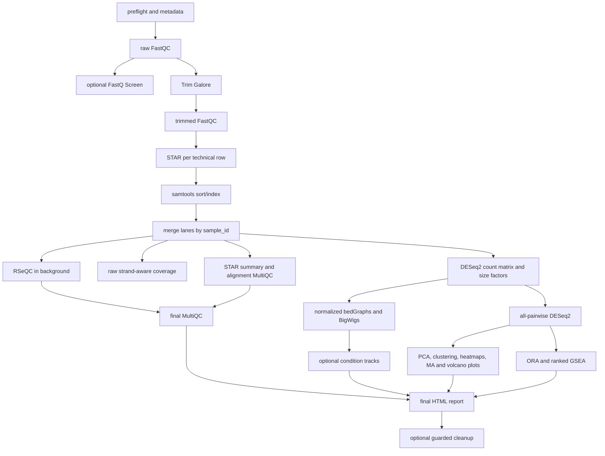

# Workflow steps and dependencies

This page follows the current executable stage order. Scientific details are in
[methods](METHODS.md), QC interpretation is in [QC.md](QC.md), and the file tree
is in [OUTPUTS.md](OUTPUTS.md).

## Dependency graph



RSeQC is the only broad downstream branch explicitly launched in the background.
It overlaps coverage, normalization, tracks, and DE analysis, then is joined
before final MultiQC. Per-lane, per-sample, and per-condition loops use the
`MAX_JOBS` throttle.

## Executable stages

| Step | Work | Main outputs and checkpoint behavior |
|---:|---|---|
| 0 | Resolve `config.conf`, validate samplesheet hierarchy/FASTQs, derive biological samples and automatic pairwise contrasts, check required tools and references. | `metadata/validated_lanes.tsv`, `validated_samples.tsv`, `analysis_samplesheet.csv`, `pairwise_contrasts.csv`; any failed preflight stops the run. |
| 1 | Create the output directory tree and load validated lane/sample metadata. | Standard folders under `OUTDIR`; log reports biological sample and technical-row counts. |
| 2 | Raw FastQC per technical row; both mates are checked for PE data. | `fastQC/raw/<library_id>/`; `.complete` sentinel permits reuse. |
| 3 | Aggregate raw FastQC. | `multiQC/raw/multiQC_raw.html`. |
| 2b | Optional FastQ Screen on R1 from each technical row. | `fastQScreen/<library_id>/`; skipped when disabled, missing, or already complete. |
| 4 | Trim Galore per technical row. | `trimmedFastq/`; complete STAR outputs also act as downstream checkpoints after cleanup. |
| 5-6 | FastQC and MultiQC for trimmed FASTQs. | `fastQC/trimmed/`, `multiQC/trimmed/multiQC_trimmed.html`. |
| 7 | STAR alignment and `--quantMode GeneCounts` per technical row. | Staged BAM, splice-junction table, STAR log, and `ReadsPerGene.out.tab`; complete staged outputs survive interrupted parallel runs. |
| 8 | Coordinate-sort and index each lane BAM. | `bams/lanes/<library_id>_sortedS.bam[.bai]`. |
| 8b | Merge lane BAMs by `sample_id`, index sample BAMs, and sum the three STAR gene-count columns after verifying gene order. | `bams/<sample_id>_sortedS.bam[.bai]`, sample-level `STARgeneCounts/`, `metadata/technical_merge_audit.tsv`. |
| 9-9b | Alignment MultiQC and lane-level STAR summary. | `multiQC/alignments/`, `07_qc/star/star_alignment_summary.tsv`. |
| 10 | Create biological-sample raw coverage from consolidated BAMs. | `bedGraph/raw/`; one unstranded signal or forward/reverse signals. |
| 10b | Compare configured strand type with BAM-derived orientation evidence. | Fast safety check; mismatch outside `STRAND_TOLERANCE_PCT` fails. |
| 10c | Run RSeQC per biological sample in a background process. | `07_qc/rseqc/` and `07_qc/multiqc/`; joined before final MultiQC. |
| 11 | Build the sample-level STAR count matrix, choose the configured strand column, estimate DESeq2 size factors, and save the model. | `analysis/counts/raw_counts.tsv`, `normalized_counts.tsv`, `size_factors.tsv`, `dds.RData`. |
| 12 | Scale each sample's bedGraph by its `sf_rpm` factor. | `bedGraph/normalized/*_norm.bedGraph.gz`. |
| 13 | Sort/filter normalized bedGraphs and convert them to BigWig. | Sample-level `.bw`, sorted bedGraph archive, and optionally all-chromosome archive in `bigwig/`. |
| 14-15 | Optionally average normalized biological-sample tracks within condition and convert them to BigWig. | Condition-level `*_merged.bw`; visualization only, never a DE input. |
| 16 | Run DESeq2 for every resolved contrast and shrink log2 fold changes with apeglm, then ashr/raw fallback. | Complete/significant TSVs plus raw/shrunken MA and volcano plots under `analysis/DE/`; annotated tables under `analysis/tables/`. |
| 17 | Generate PCA, sample-distance clustering, top-500 variable-gene heatmap, and mean-SD diagnostics. | PDF and PNG files under `analysis/figures/`. |
| 18 | Optionally create one-line UCSC custom-track definitions when a real base URL is configured. | `reports/ucsc_tracks.txt`, `reports/bigwig_summary.txt`. |
| 19 | Wait for RSeQC and aggregate raw/trimmed/alignment/FastQ Screen/RSeQC evidence. | `multiQC/final/multiQC_final.html`. |
| 20 | Run contrast-specific ORA and ranked GSEA. | GO, KEGG, Reactome, and Hallmark tables/plots under `analysis/enrichment/<contrast>/`. |
| 21 | Record checksummed run provenance and render the self-contained HTML report. | `metadata/run_provenance.tsv`, `reports/pipeline_report.html`. |
| 22 | Optionally delete allow-listed regenerable intermediates after completion checks. | Cleanup messages in the master log; durable results are retained. |

## Parallel execution

`MAX_JOBS` limits concurrent shell jobs in lane-, sample-, and condition-level
loops. Threads inside each job are controlled separately.

| Work | Concurrency |
|---|---|
| Raw/trimmed FastQC | up to `MAX_JOBS`, each using `FASTQC_THREADS` |
| FastQ Screen | up to `MAX_JOBS`, each using `FASTQSCREEN_THREADS` |
| Trim Galore | up to `MAX_JOBS` |
| STAR | up to `MAX_JOBS`, each using `STAR_THREADS` |
| samtools sorting | up to `MAX_JOBS`, each using `SAMTOOLS_THREADS` |
| Sample coverage and normalization | up to `MAX_JOBS` |
| Condition track merging | up to `MAX_JOBS` |
| RSeQC | per-module/per-sample jobs throttled by `MAX_JOBS`, while other downstream work runs |
| DESeq2 model/contrasts and enrichment | serial R invocations in the current implementation |

Peak STAR CPU demand is approximately `MAX_JOBS * STAR_THREADS`; memory must be
budgeted for the same number of concurrent STAR processes. `MAX_JOBS` is not a
global thread ceiling.

## Checkpoints and reruns

The workflow recognizes completed outputs at lane, sample, and stage level. A
normal rerun skips them and continues from missing work. `FORCE_RERUN=1` ignores
most output checkpoints and should be used only when the retained inputs and
outputs are understood.

The current launcher intentionally has a small interface:

```bash
rnaseq2tracks --config /path/to/config.conf
rnaseq2tracks --version
```

It does not yet implement the stage controls available in `rna_ends2tracks`.
